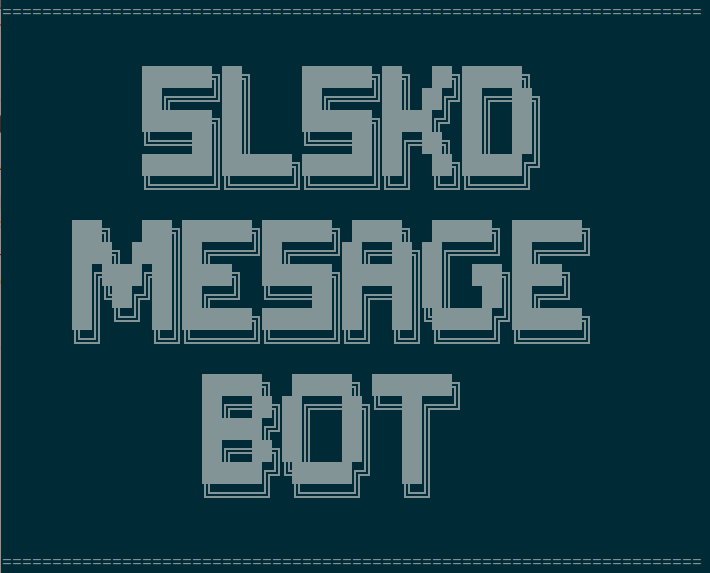
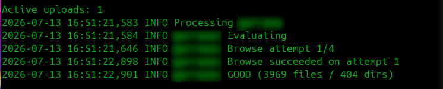
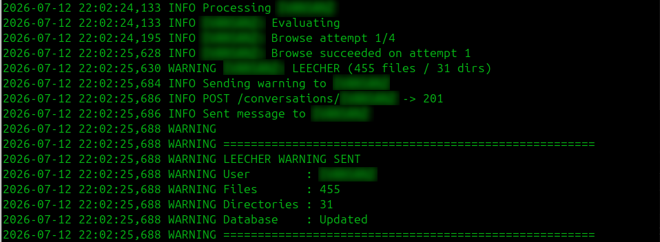
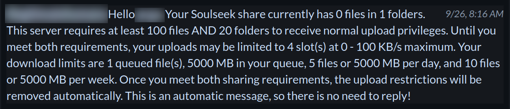
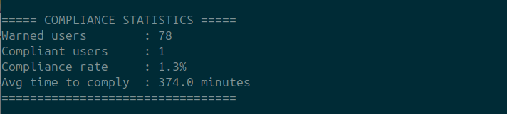

# slskd-message-bot

[](https://github.com/illegitimatehumans/slskd-message-bot/pkgs/container/slskd-message-bot)
[](https://www.python.org/)
[](https://github.com/illegitimatehumans/slskd-message-bot/blob/main/LICENSE)
[](https://github.com/illegitimatehumans/slskd-message-bot/releases/tag/v1.5.0)



An automated sharing policy bot for [slskd](https://github.com/slskd/slskd).

`slskd-message-bot` monitors active uploads, evaluates users against the sharing requirements configured in slskd, and sends a customizable private message when those requirements are not met.

The bot reads sharing thresholds and transfer limits directly from the running slskd instance, so there is no need to maintain duplicate settings in the bot configuration.

## Features

- Monitors active uploads
- Applies a configurable grace period before evaluation
- Evaluates users against slskd sharing requirements
- Synchronizes with slskd transfer group settings
- Retries temporary browse failures with configurable delays
- Uses caching to reduce unnecessary browse requests
- Prevents duplicate warning messages
- Supports customizable warning messages and dynamic placeholders
- Supports a username whitelist
- Tracks user state and historical statistics in SQLite
- Automatically removes statistics older than the configured retention period
- Supports configurable recheck intervals and progressive backoff
- Displays slskd connection, username, API, and configuration information at startup
- Supports Docker and Docker Compose
- Provides prebuilt images through GitHub Container Registry
- Runs as a configurable non-root user
- Supports configurable time zones

## How It Works

1. The bot monitors active uploads in slskd.
2. A configurable grace period gives new uploaders time to share normally.
3. The bot browses the user's shared files.
4. Shared files and directories are compared with the requirements configured in the active slskd transfer group.
5. Users who do not meet the requirements receive a private warning message.
6. Evaluation results are stored in SQLite to reduce unnecessary repeated browsing.
7. Previously warned users are not sent duplicate warnings.
8. Users are periodically rechecked according to their configured recheck intervals.

The bot does not enforce transfer restrictions itself. Upload priorities, slots, bandwidth limits, and queue restrictions remain controlled by slskd.

## Screenshots

### Upload Evaluation

The bot monitors active uploads and records evaluation results.



### Warning Detection

Users who do not meet the configured sharing requirements are identified and warned.



### Warning Message

Warning messages are fully customizable and can use live values from the slskd transfer group.



### Compliance Statistics 



## Requirements

- Docker
- Docker Compose
- slskd 0.25 or newer

Python is only required when developing or running the application directly outside Docker.

## Installation

Clone the repository:

```bash
git clone https://github.com/illegitimatehumans/slskd-message-bot.git
cd slskd-message-bot
```

Copy the example environment file:

```bash
cp .env.example .env
```

Edit `.env` and configure the slskd connection:

```env
SLSKD_URL=http://slskd:5030
SLSKD_API_KEY=YOUR_API_KEY
```

Start the bot:

```bash
docker compose up -d
```

On first startup, the bot creates:

```text
data/message.txt
```

from:

```text
message.txt.example
```

The message file can be edited at any time without rebuilding the container.

## Docker

### Docker Compose Configuration

Example `docker-compose.yml`:

```yaml
services:
  slskd-bot:
    image: ghcr.io/illegitimatehumans/slskd-message-bot:latest
    container_name: slskd-bot
    user: "${PUID}:${PGID}"
    cap_drop:
      - ALL
    environment:
      - TZ=${TZ}
      - SLSKD_URL=${SLSKD_URL}
      - SLSKD_API_KEY=${SLSKD_API_KEY}
    restart: unless-stopped
    env_file:
      - .env
    volumes:
      - ./app:/app/app
      - ./data:/app/data
      - ./logs:/app/logs
      - ./message.txt.example:/app/message.txt.example:ro
    networks:
      - media-stack

networks:
  media-stack:
    external: true
```

### Development

The development Compose file builds the image from the local source tree.

```bash
docker compose -f docker-compose.dev.yml up -d --build
```

This is useful for testing changes before creating a release.

## Configuration

The following environment variables are available:

| Variable | Description | Default |
|---|---|---|
| `SLSKD_URL` | slskd API URL | `http://slskd:5030` |
| `SLSKD_API_KEY` | slskd API key | — |
| `PUID` | Container user ID | `1000` |
| `PGID` | Container group ID | `1000` |
| `TZ` | Container timezone | — |
| `CHECK_INTERVAL` | Seconds between upload scans | `60` |
| `GRACE_PERIOD` | Seconds before evaluating a new uploader | `120` |
| `GOOD_RECHECK_MINUTES` | Recheck interval for compliant users | `1440` |
| `LEECHER_RECHECK_MINUTES` | Recheck interval for users below the sharing requirements | `60` |
| `BROWSE_RETRY_DELAYS` | Retry delays in seconds | `2,5,10` |
| `UNKNOWN_RECHECK_MINUTES` | Recheck interval for users whose browse evaluation failed | `10` |

Example:

```env
SLSKD_URL=http://slskd:5030
SLSKD_API_KEY=YOUR_API_KEY

PUID=1000
PGID=1000

TZ=America/New_York

CHECK_INTERVAL=60
GRACE_PERIOD=120

GOOD_RECHECK_MINUTES=1440
LEECHER_RECHECK_MINUTES=60
UNKNOWN_RECHECK_MINUTES=10
UNKNOWN_RECHECK_BACKOFF_MINUTES=10,10,30,60,1440

BROWSE_RETRY_DELAYS=2,5,10
```

Unknown users use progressive recheck backoff to avoid repeatedly browsing users whose shares cannot be retrieved.

By default:

- Failure 1 → 10 minutes
- Failure 2 → 10 minutes
- Failure 3 → 30 minutes
- Failure 4 → 60 minutes
- Failure 5+ → 24 hours

A successful browse resets the failure counter.

The backoff can be configured with:

```env
UNKNOWN_RECHECK_BACKOFF_MINUTES=10,10,30,60,1440
```
## slskd Integration

The bot uses the slskd REST API to monitor uploads, browse users, send private messages, and read the active transfer group configuration.

Private messages are sent through:

```text
POST /api/v0/conversations/{username}
```

The active slskd configuration is read through:

```text
GET /api/v0/options
```

The bot reads the active leecher transfer group from slskd and uses its configured values when generating warning messages.

This includes:

- Sharing thresholds
- Upload slots
- Transfer speed limits
- Queue limits
- Daily limits
- Weekly limits

This keeps warning messages synchronized with the actual limits enforced by slskd.

## Browse Retries

A user may not respond to a browse request immediately. The bot can retry failed browse requests before marking the evaluation as `UNKNOWN`.

Configure retry delays with:

```env
BROWSE_RETRY_DELAYS=2,5,10
```

This results in:

| Attempt | Action |
|---|---|
| 1 | Browse immediately |
| 2 | Retry after 2 seconds |
| 3 | Retry after 5 seconds |
| 4 | Retry after 10 seconds |

The number of attempts is determined automatically from the configured delay list.

## Message Templates

Warning messages are stored in:

```text
data/message.txt
```

On first startup, the file is created from:

```text
message.txt.example
```

The message can be customized without rebuilding the container.

### Available Placeholders

| Placeholder | Description |
|---|---|
| `{username}` | Username being evaluated |
| `{files}` | User's shared file count |
| `{directories}` | User's shared directory count |
| `{min_files}` | Minimum required shared files |
| `{min_directories}` | Minimum required shared directories |
| `{upload_slots}` | Upload slots configured for the transfer group |
| `{speed_limit}` | Maximum transfer speed configured for the group |
| `{queue_files}` | Maximum queued downloads |
| `{queue_size}` | Maximum queued download size in MB |
| `{daily_files}` | Daily file limit |
| `{daily_size}` | Daily transfer limit in MB |
| `{daily_failures}` | Daily failure limit, when configured |
| `{weekly_files}` | Weekly file limit |
| `{weekly_size}` | Weekly transfer limit in MB |
| `{weekly_failures}` | Weekly failure limit, when configured |

### Example

The example warning message is kept on a single line so the resulting private message is sent as one continuous message.

```text
Hello {username}. Your files: {files}. Your folders: {directories}. Minimum sharing requirements: {min_files} files and {min_directories} folders. Your uploads may be limited to {upload_slots} upload slot(s) and {speed_limit} KB/s maximum transfer speed. Queue limits: {queue_files} queued download(s), queue size: {queue_size} MB, daily: {daily_files} files or {daily_size} MB, weekly: {weekly_files} files or {weekly_size} MB. Sharing is caring. Thanks for contributing!
```

## Warning Policy

A user is considered compliant only when both configured sharing requirements are met:

- Minimum shared files
- Minimum shared directories

A warning is sent when either requirement is below the configured minimum.

For example, if the server requires 100 files and 20 directories, a user with 150 files but only 10 directories will still be considered below the sharing requirements.

The bot does not enforce upload restrictions itself. slskd remains responsible for applying the transfer group settings.

## Caching and Rechecks

The bot uses session and database caching to reduce unnecessary browse requests.

Users who have already been processed during the current bot session are not repeatedly evaluated.

Evaluation results are stored in SQLite so the bot can avoid unnecessary browse requests between sessions.

Recheck intervals can be configured independently:

```env
GOOD_RECHECK_MINUTES=1440
LEECHER_RECHECK_MINUTES=60
UNKNOWN_RECHECK_MINUTES=10
```

## Statistics

The bot records historical evaluation events in SQLite.

Statistics include:

- Users evaluated
- GOOD evaluations
- LEECHER evaluations
- UNKNOWN evaluations
- Browse successes
- Browse failures
- Evaluation duration
- Warnings sent
- Session cache hits
- Database cache hits

Statistics are stored in:

```text
data/warned.sqlite
```

The database is persistent when the `data` directory is mounted as a Docker volume.

## Project Structure

```text
app/
├── api/
│   └── slskd.py
├── database/
│   └── database.py
├── services/
│   ├── evaluator.py
│   ├── messenger.py
│   ├── monitor.py
│   ├── processor.py
│   └── runtime.py
├── utils/
│   └── logger.py
├── config.py
└── main.py

assets/
├── assets-upload-evaluation.png
├── warning-detection.png
└── warning-message.png

data/
└── message.txt

docker-compose.yml
docker-compose.dev.yml
Dockerfile
message.txt.example
```

## Roadmap

### Future

Planned improvements include:

- Compliance rate tracking
- Users who become compliant
- Average time until compliance
- Warning effectiveness
- Runtime configuration reload
- Configurable whitelist and blacklist files
- Log rotation
- Performance logging
- Additional message placeholders
- Discord notifications
- Administrative tools
- Improved slskd integration

### v2.x

An optional web dashboard for viewing bot statistics, user history, compliance trends, and system activity.

## Community

Need help, want to report a bug, or have an idea for the project?

Join the Discord community:

[](https://discord.gg/2WeBqUPEjJ)

## License

MIT License.

See [LICENSE](LICENSE) for the full license text.
